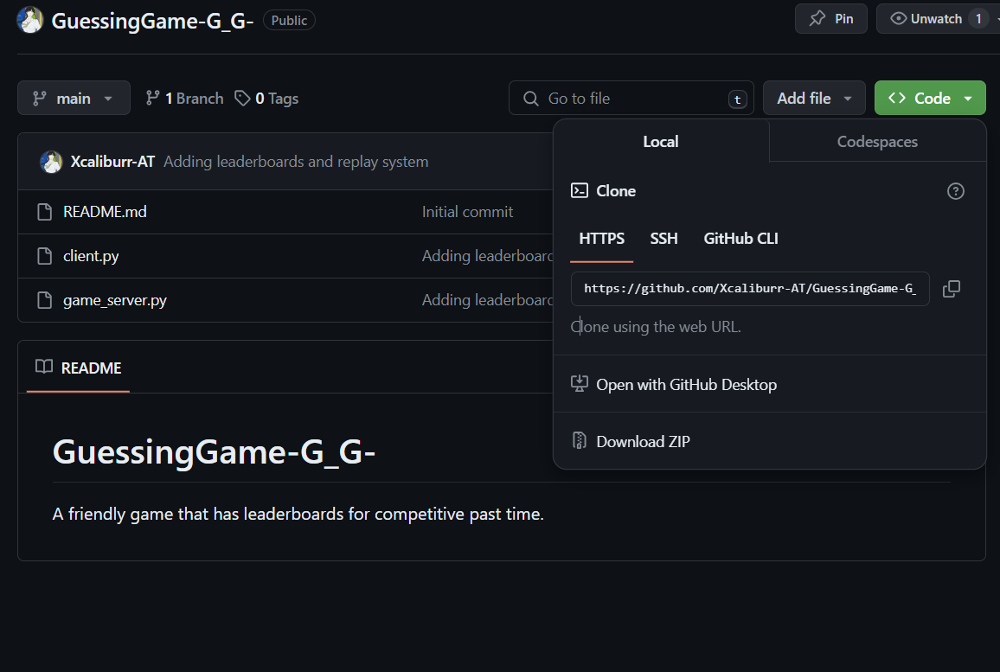
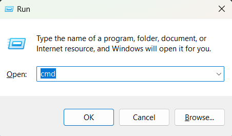
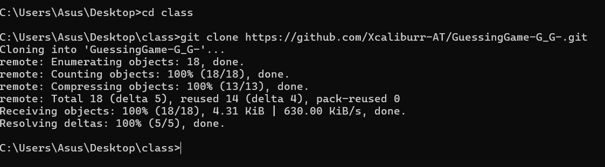
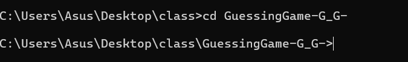

### GuessingGame-G_G-
A friendly game that has leaderboards for competitive past time.

## How to Install

Download the source codes and file from this repository, or just clone it in your local device.

#### 1. To Clone:

Go to

### Copy the link present, and in your keyboard press 'Win' Windows key + r. Then type cmd

#
#### A command line interface will appear.

### 2. CMD
In commnad line goto the desired directory you want to store the game. for example. 

###
*** 
git clone [*"url of the repository"*]
***
###
#### This is what it will looks like

###
### 3. Navigate to the *GuessingGameG_G* directory

## To play the game
####
Inside that directory activate first the server by typing
***
python game_server.py
***

then press enter

#### Open a new cmd, and navigate to the *GuessingGameG_G* directory. (repeat step 3)

type the following to the newly opened cmd terminal
***
python client.py
***

### You can now start playing.

### Author:
Molato, Jeffer I.

BSIT 2 B 3